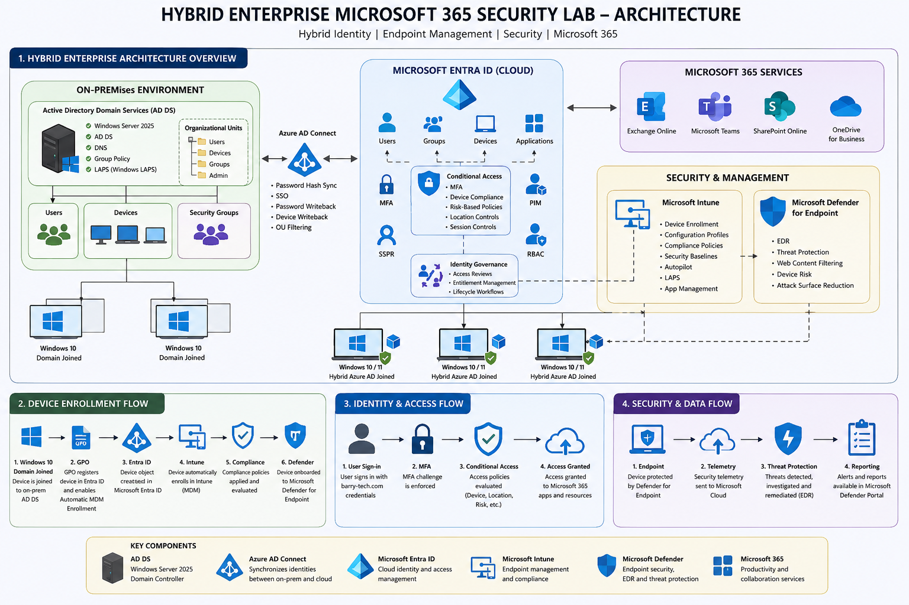

# Hybrid Enterprise Microsoft 365 Security Lab

Enterprise-style hybrid infrastructure environment built using:

- Microsoft Entra ID
- Microsoft Intune
- Microsoft Defender for Endpoint
- Active Directory Domain Services
- Azure AD Connect
- Microsoft 365 E5

---

# Overview

This project simulates a real-world hybrid enterprise environment integrating:

- Active Directory Domain Services (AD DS)
- Microsoft Entra ID
- Microsoft Intune
- Microsoft Defender for Endpoint
- Exchange Online
- Microsoft Teams
- SharePoint Online

The lab demonstrates enterprise identity management, endpoint security, cloud authentication, compliance enforcement, and modern device management.

---

# Architecture

# Architecture

# Core Areas

## Active Directory Infrastructure
- Windows Server 2025
- DNS
- Organizational Units
- Security Groups
- Group Policy

## Identity & Access Management
- Microsoft Entra ID
- Azure AD Connect
- MFA
- Conditional Access
- Risk-Based Policies
- RBAC
- PIM
- Identity Governance
- SSPR

## Endpoint Management
- Microsoft Intune
- Hybrid Azure AD Join
- Automatic MDM Enrollment
- Compliance Policies
- Security Baselines
- Windows LAPS
- Windows Autopilot

## Security Operations
- Microsoft Defender for Endpoint
- Endpoint Detection & Response (EDR)
- Web Content Filtering
- Device Risk Monitoring

## Microsoft 365 Administration
- Exchange Online
- Microsoft Teams
- SharePoint Online
- Dynamic Group Licensing
