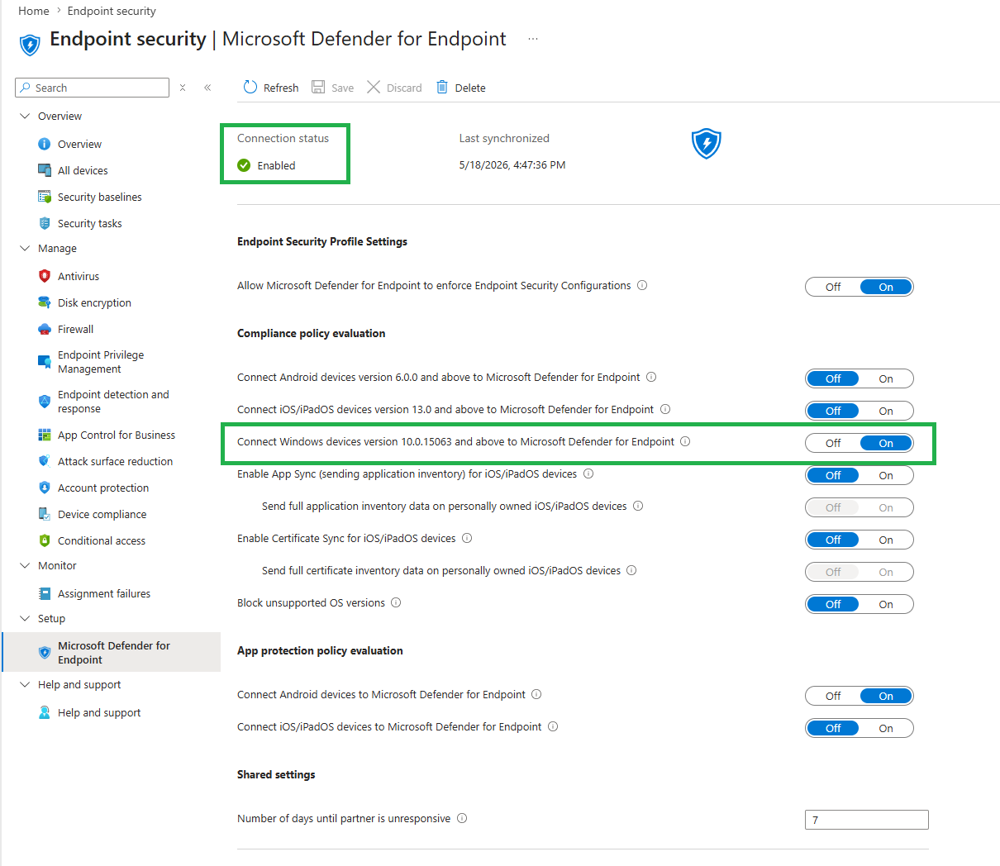
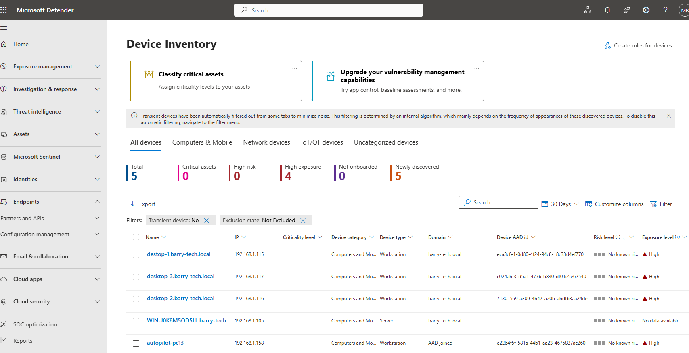
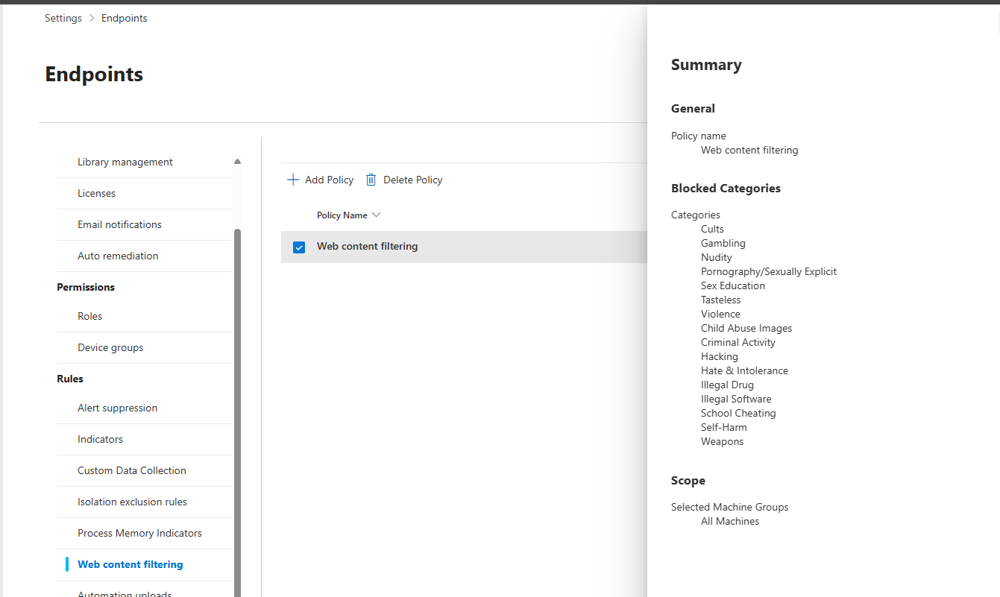

# Microsoft Defender for Endpoint Integration

# Objective

Integrate Microsoft Intune with Microsoft Defender for Endpoint to provide:

- Centralized endpoint protection
- Automated EDR onboarding
- Threat detection and response
- Device inventory visibility
- Exposure management
- Web protection and filtering
- Security telemetry and monitoring

---

# Enable Defender Connector

## Intune Admin Center

### Path

```text
Endpoint Security
→ Microsoft Defender for Endpoint
```

Enabled:

```text
Connect Windows devices version 10.0.15063 and above to Microsoft Defender for Endpoint
```

Configured:

```text
Allow Microsoft Defender for Endpoint to enforce Endpoint Security Configurations = On
```


# Configure Endpoint Detection and Response (EDR)

## Intune Admin Center

### Path

```text
Endpoint Security
→ Endpoint Detection and Response
```

Created onboarding profile:

```text
EDR for Windows
```

Assigned onboarding policy to:
- Managed Windows devices
- MicrosoftSense target group

---

# Device Onboarding Flow

```text
1. Device joins Active Directory
2. Device syncs to Entra ID
3. Device becomes Hybrid Azure AD Joined
4. MDM auto-enrollment policy applies
5. Device enrolls into Intune
6. Compliance policies apply
7. Defender onboarding policy applies
8. Device onboarded to Defender
```

---

# Device Inventory & Exposure Management

## Defender Portal

### Path

```text
Assets
→ Devices
→ Device Inventory
```

---

# Exposure Monitoring

Monitored:
- High exposure devices
- Device risk posture
- Security recommendations
- Endpoint telemetry
- Threat visibility


---

# Web Content Filtering

# Objective

Restrict access to unsafe and malicious websites using Microsoft Defender for Endpoint web protection policies.

---

# Blocked Categories

Configured blocking for:
- Gambling
- Pornography/Sexually Explicit
- Violence
- Hacking
- Illegal Software
- Weapons
- Self-Harm
- Criminal Activity


---

# Security Benefits

- Centralized endpoint protection
- Automated device onboarding
- Threat detection and remediation
- Endpoint visibility and telemetry
- Reduced attack surface
- Web threat protection
- Compliance-aware security enforcement

---

# Skills Demonstrated

- Microsoft Defender for Endpoint
- Intune Security Integration
- Endpoint Detection & Response (EDR)
- Device Inventory Monitoring
- Exposure Management
- Web Content Filtering
- Enterprise Endpoint Security
- Threat Protection
- Security Policy Enforcement