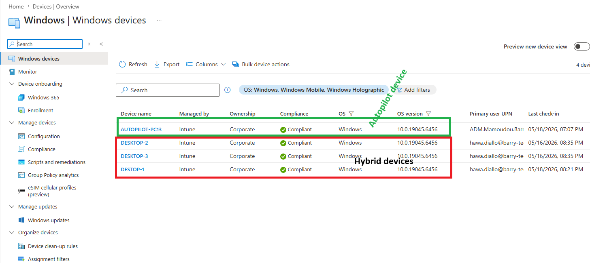
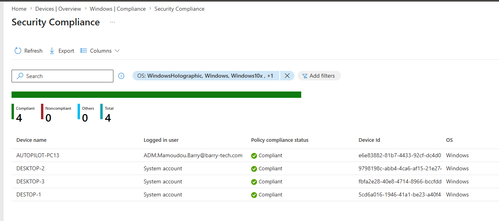
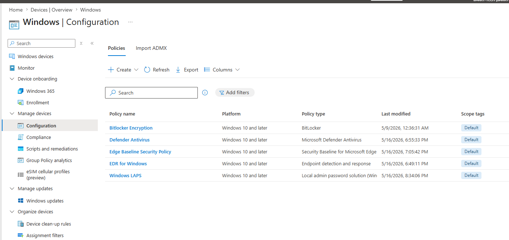
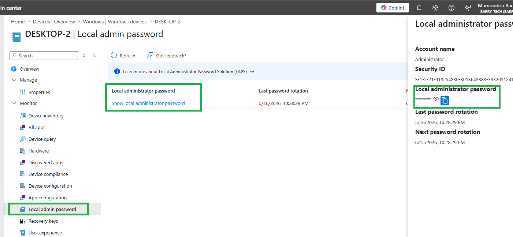
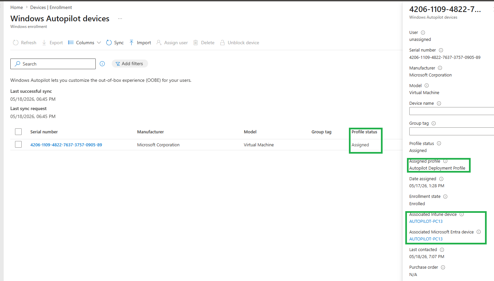

# Endpoint Management

# Overview

Configured Microsoft Intune for enterprise endpoint management, compliance enforcement, and device security.

---

# Configure Intune

Configured Microsoft Intune as MDM authority.

---

# Automatic Enrollment Configuration

Path:

```text
Devices
→ Enroll Devices
→ Automatic Enrollment
```

Configured:

| Setting | Value |
|---|---|
| MDM User Scope | All |


---

# Hybrid Enrollment Flow

```text
1. Device joins Active Directory
2. Device syncs to Entra ID
3. Device becomes Hybrid Azure AD Joined
4. MDM auto-enrollment policy applies
5. Device enrolls into Intune
6. Compliance policies apply
7. Defender onboarding policy applies
8. Device onboarded to Defender
```

---

# Validate Intune Enrollment



---

# Compliance Policies

Configured:
- BitLocker required
- Firewall enabled
- Antivirus required
- TPM required
- Secure Boot required
- Password policy enforcement


---

# Configuration Profiles

Configured:
- Device restrictions
- Endpoint protection
- Browser restrictions
- Security hardening



---


# Windows LAPS

Configured:
- Automatic password rotation
- Password backup to Entra ID
- Local admin account management



---

# Windows Autopilot

## Export Hardware Hash

Uploaded hardware hash into Intune using script.


Configured:
- User-driven deployment
- Entra ID Join
- Automatic enrollment



---

