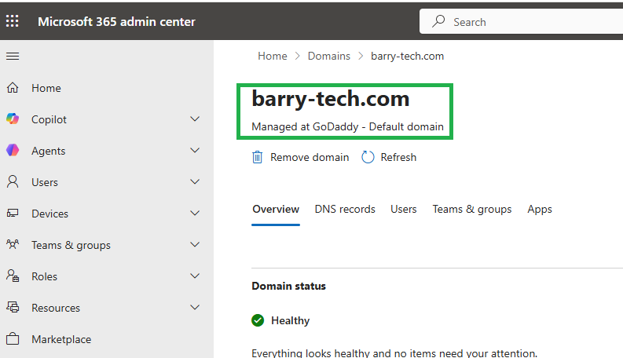
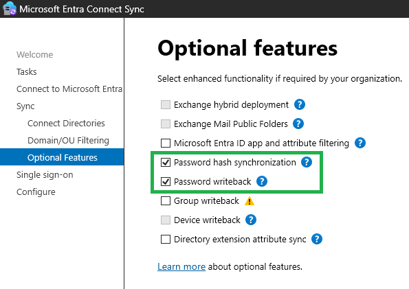
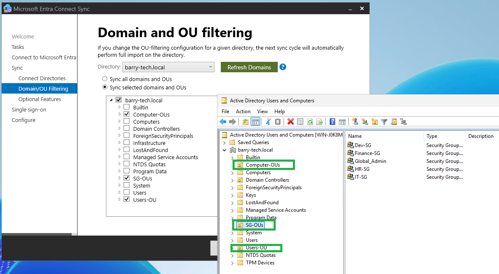
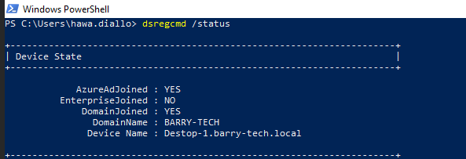
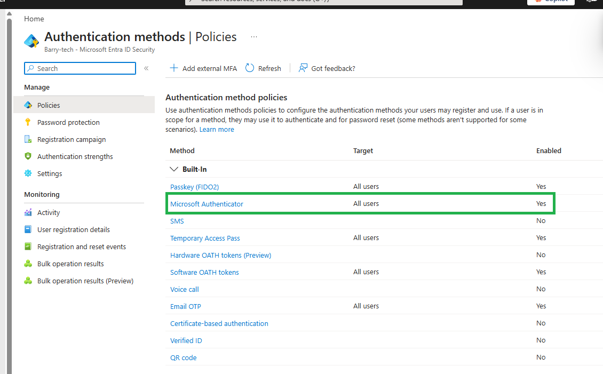
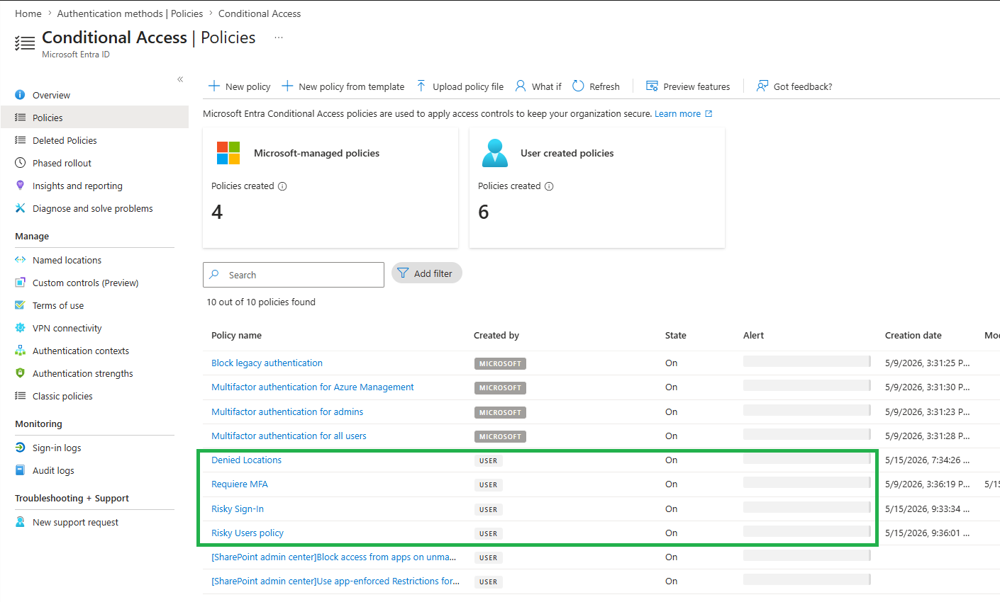
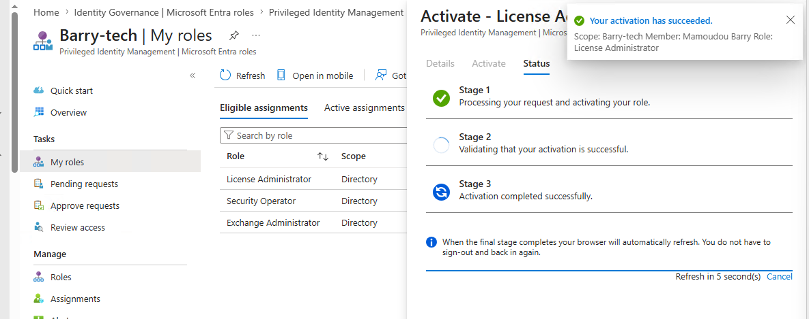
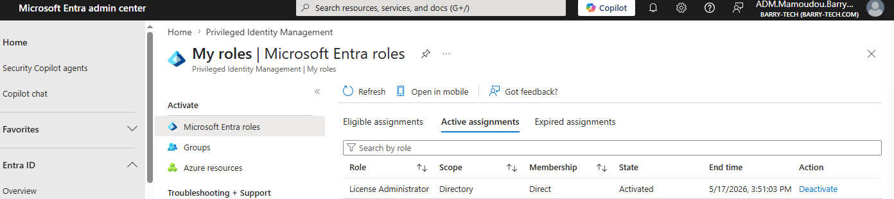
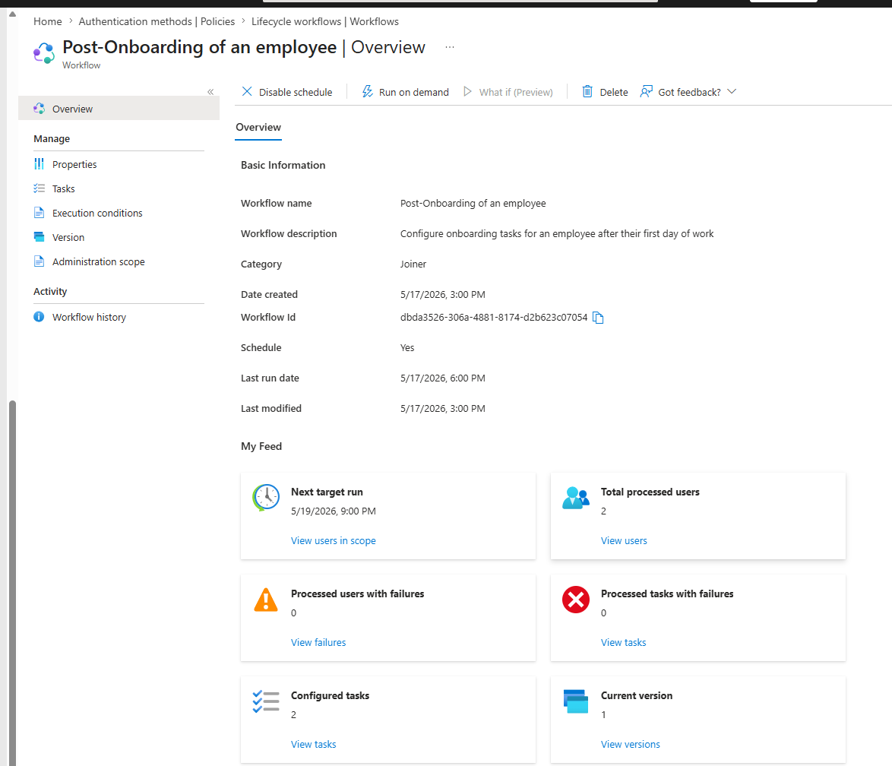

# Identity & Access Management (IAM)

# Overview

Configured a hybrid identity environment integrating Active Directory with Microsoft Entra ID using Azure AD Connect.

Implemented enterprise authentication, access control, governance, and privileged access management.

---

# Tenant Setup

Configured:
- Microsoft 365 E5 tenant
- Custom domain
- Administrative roles
- User licensing

---

# Custom Domain Configuration

Added:

```text
barry-tech.com
```

Validated ownership using DNS TXT records.



---

# Azure AD Connect Deployment

Installed Azure AD Connect on Windows Server 2025.

Configured:
- Password Hash Synchronization
- Seamless Single Sign-On
- Password Writeback
- OU Filtering



Synchronized:
- Users
- Devices
- Security Groups


---

# Hybrid Azure AD Join

Enabled:

```text
Hybrid Azure AD Join
```

For:

```text
Windows 10 and later
```

---

# Validate Hybrid Join

Command:

```powershell
dsregcmd /status
```


# Multi-Factor Authentication (MFA)

Configured:
- Microsoft Authenticator
- SMS verification
- MFA enforcement


---

# Conditional Access Policies

Configured:
- Require MFA
- Block legacy authentication
- Require compliant devices
- Restrict admin access

---

# Risk-Based Policies

Configured:
- Sign-in risk policies
- User risk policies

---



# RBAC

Configured:
- Global Administrator
- Intune Administrator
- Security Administrator
- Compliance Administrator
- Helpdesk Administrator

---

# Privileged Identity Management (PIM)

Configured:
- Eligible role assignments
- Just-in-Time access
- Approval workflows
- Time-limited activation



---

# Identity Governance

Configured:
- Access Reviews
- Entitlement Management
- Lifecycle Workflows


---

# Self-Service Password Reset (SSPR)

Configured:
- Password writeback
- Authentication methods
- Self-service reset policies

---

